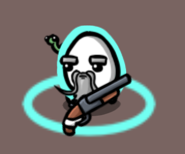
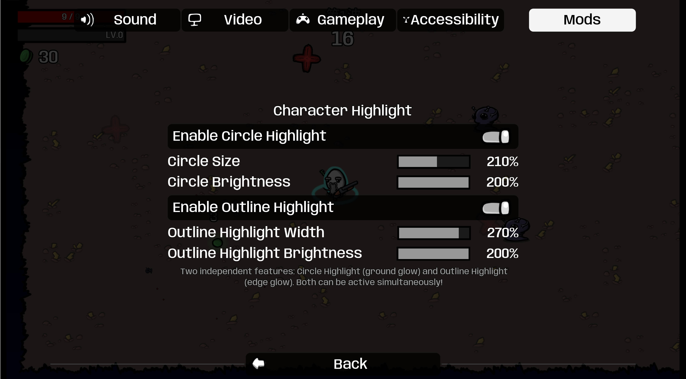

# Character Highlight Mod

Enhances character visibility in Brotato with two customizable, independent highlight features.

## Features

- **Circle Highlight**: Ground glow that's always visible above enemies
- **Outline Highlight**: Edge glow around your character
- **Fully Independent**: Each feature has its own toggle and configuration
- **Multiplayer Colors**: Automatically uses player-specific colors in coop mode
- **Real-time Config**: All adjustments apply instantly via ModOptions
- **Non-invasive**: Works independently of vanilla "Highlight your character" setting

## Screenshots

*Highlight your character*

*Configuration options in ModOptions menu*

## Installation

Install via Steam Workshop or download from the repository.

**Optional:**
- **ModOptions** (Oudstand-ModOptions) - Enables in-game configuration UI
- Without ModOptions, the mod uses default settings and works perfectly fine

## Configuration

Requires **Oudstand-ModOptions** for configuration (optional).

Go to Options → Mods → Character Highlight:

### Circle Highlight
- **Enable**: Toggle on/off (default: ON)
- **Size**: 1.0-3.0x (default: 1.5x)
- **Brightness**: 0.5-2.0x (default: 1.0x)

### Outline Highlight
- **Enable**: Toggle on/off (default: ON)
- **Width**: 1.0-3.0 (default: 1.5)
- **Brightness**: 0.5-2.0x (default: 1.0x)

**Tip**: Both features can be active simultaneously!

## Technical Details

### Circle Highlight
- Independent sprite node above enemies but below player
- Smart z-index management for proper layering
- HSV color processing preserves hue at all brightness levels
- Player-specific colors in multiplayer

### Outline Highlight
- Uses game's native outline shader (same as cursed enemies)
- Direct shader control for precise width and brightness adjustments
- Independent z-index management or shared with circle highlight feature
- HSV color adjustments prevent white-out at high brightness

## Requirements

- Brotato v1.1.12.0 or compatible
- ModLoader v6.2.0 or compatible
- Optional: Oudstand-ModOptions for configuration

## Compatibility

Compatible with most mods. Does not interfere with vanilla highlight setting.

## Credits

- Author: tttt
- Mod: Oudstand-ModOptions

## License

This mod is provided as-is for the Brotato community. Feel free to modify and share.

## Support

For bugs or feature requests, please create an issue on the project repository.

## Changelog

### v1.0.0
- Initial release
- Added Circle Highlight and Outline Highlight
- Multi-player support

